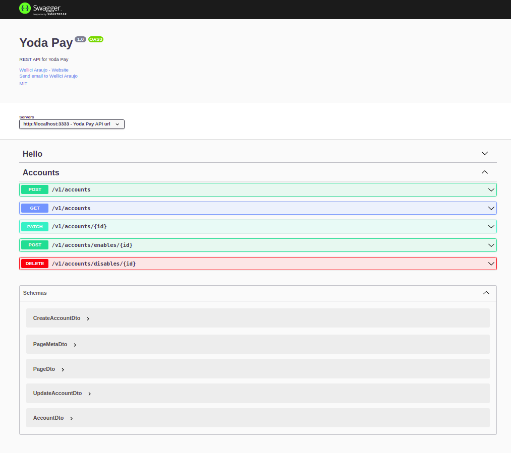

<h1 align="center">Welcome to Yoda Pay API 👋</h1>
<p>
  
  <a href="https://mit-license.org" target="_blank">
    
  </a>
  <a href="https://twitter.com/wdev007" target="_blank">
    
  </a>
</p>

> REST API for Yoda Pay

### 🏠 [Homepage](https://github.com/wdev007/challenge-backend-mutual-yoda-pay)

<br/>

### Built With

This section should list any major frameworks/libraries used to bootstrap your project. Leave any add-ons/plugins for the acknowledgements section. Here are a few examples.

- [Nest.js](https://nestjs.com/)
- [TypeOrm](https://typeorm.io)
- [Postgresql](https://www.postgresql.org/)
- [Typescript](https://www.typescriptlang.org/)
- [Jest](https://jestjs.io/docs/getting-started/)
- [Docker](https://www.docker.com/)
- [Docker Compose](https://docs.docker.com/compose/)
- [Swagger](https://swagger.io/)

<!-- GETTING STARTED -->

## Getting Started

Instructions on setting up your project locally.
To get a local copy up and running follow these simple example steps.

### Prerequisites

List things you need to use the software and how to install them.

#### Roadmap

- [x] docker
- [x] docker compose

### Installation

1. Clone the repo
   ```sh
   git clone https://github.com/wdev007/challenge-backend-mutual-yoda-pay
   ```
2. Change the settings files
   ```sh
   cp .env.example .env
   ```

## Usage

```sh
docker-compose up
```

## Run tests

```sh
yarn run test
```

## To see the documentation

- Open the address of your api in your browser, for example: localhost:3333/api

- ### Swagger UI



- ### Test your http requests there

<br/>

## Author

👤 **Wellici Araujo**

- Website: https://github.com/wdev007
- Twitter: [@wdev007](https://twitter.com/wdev007)
- Github: [@wdev007](https://github.com/wdev007)
- LinkedIn: [@Wellici Araújo](https://linkedin.com/in/Wellici Araújo)

## 🤝 Contributing

Contributions, issues and feature requests are welcome!<br />Feel free to check [issues page](https://github.com/wdev007/challenge-backend-mutual-yoda-pay/issues).

## Show your support

Give a ⭐️ if this project helped you!

## 📝 License

Copyright © 2021 [Wellici Araujo](https://github.com/wdev007).<br />
This project is [MIT](https://mit-license.org) licensed.

---

_This README was generated with ❤️ by [readme-md-generator](https://github.com/kefranabg/readme-md-generator)_
